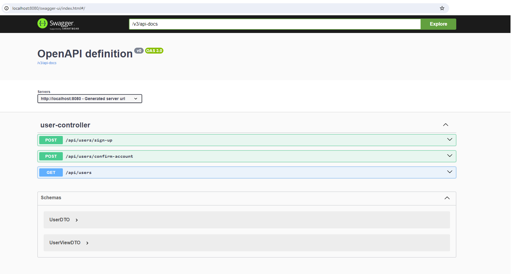

# utask-java

TODO

# Code Style Format

To maintain consistency and adhere to project standards, ensure you import format configuration file from
`docs/code_style/your_environment` and apply it before committing to this project. Currently, configurations 
are available for Intellij Idea and Eclipse environments.

# Swagger

1. Run the server.

2. Go to http://localhost:8080/swagger-ui/index.html#/.

# How to set up SonarQube

1. Run the following command:
`docker run -d --name sonarqube -e SONAR_ES_BOOTSTRAP_CHECKS_DISABLE=true -p 9000:9000 sonarqube:latest`

2. Open http://localhost:9000/, and register in the system. Your default login and password are `admin`. You should change the password; for example, change it to `password`.

3. After that, go to the Personal settings (top right corner) > Security. Here, you should create the `Global Analysis Token` without an expiration date. Then, copy it to the `sonar.token` property inside the root `pom.xml` file.

4. Run the `./mvnw clean verify sonar:sonar` command. Then, you will see the `utask-project` in the `Projects` tab.
